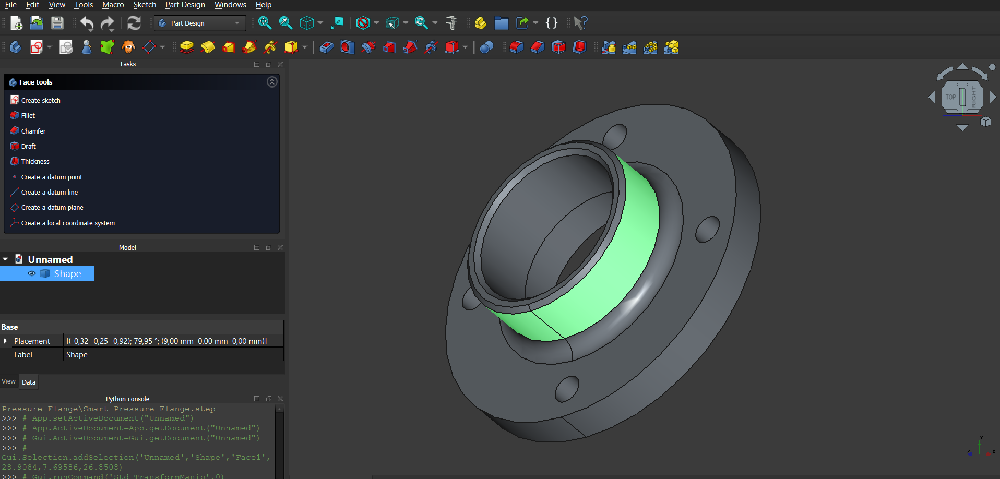

# Smart Pressure Flange Generative Design

**Copyright (c) 2026 altugrakay-commits. All rights reserved.**

This repository features a parametric CAD pipeline that bridges analytical optimization with automated 3D modeling.

## 🚀 How It Works
The project uses a two-stage automated process:
1. **Analytical Optimization:** `flange_optimizer.py` calculates required bore and wall thickness based on pressure inputs and saves them to a data exchange file.
2. **Generative CAD:** `flange_generator.py` (FreeCAD) reads the optimized data to construct a manifold 3D solid.

## 🛠️ Key Technical Features
* **Structural Reinforcement:** Automated 5.0mm structural fillets at high-stress junctions.
* **Assembly Lead-ins:** 1.5mm chamfers on hub rims for easier pipe mating.
* **Data-Driven:** Fully parametric—change the input data, and the 3D model updates automatically.
* **Mass Analysis:** Automatic calculation of volume and estimated weight in Steel.

## 📋 Requirements
- **FreeCAD 0.21+** (The generator script must be run within the FreeCAD environment).
- **Python 3.x**
