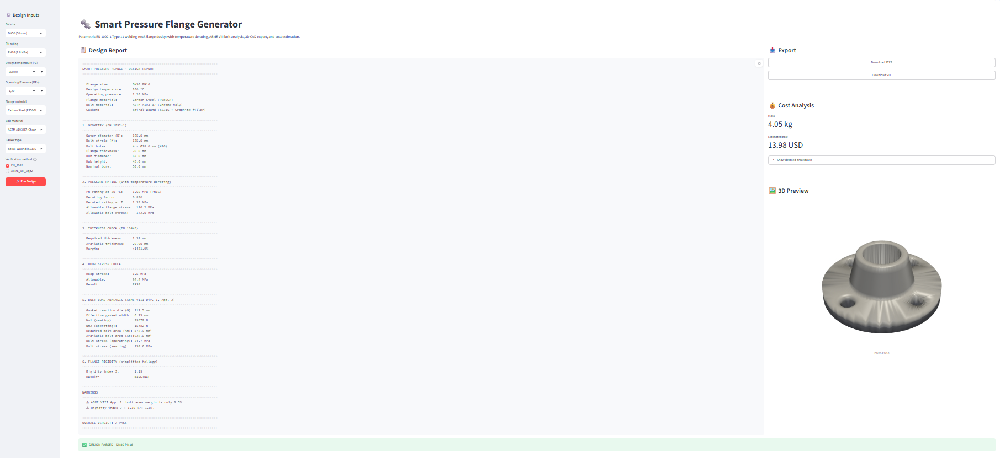
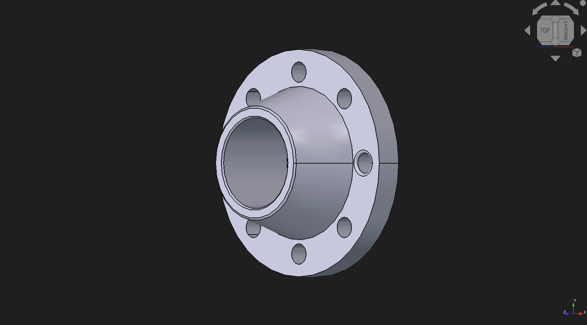
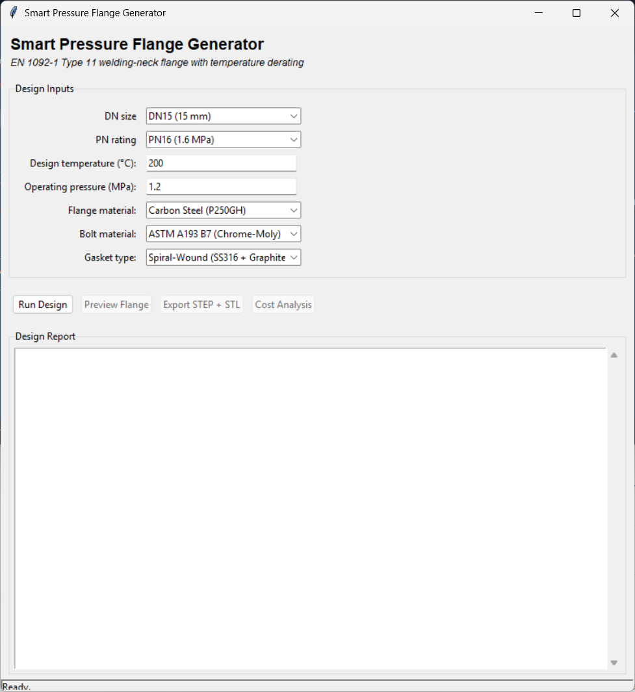

# 🔩 Smart Pressure Flange Generator

**Parametric EN 1092-1 Type 11 welding-neck flange design with temperature
derating, ASME VIII bolt analysis, CAD export, and cost estimation.**

[](LICENSE)
[](https://www.python.org/downloads/)
[](https://cadquery.readthedocs.io/)
[](https://streamlit.io/)

---

## ✨ Overview

The **Smart Pressure Flange Generator** is an open-source engineering tool
that automates the design of **EN 1092-1 Type 11 welding-neck flanges**.
It takes a small set of process inputs — nominal size, pressure rating,
operating temperature, and material — and produces:

1. A complete **design report** following EN 13445 and ASME VIII Div. 1
   Appendix 2.
2. A **3D CAD model** (STEP + STL) built programmatically with CadQuery.
3. A **weight and cost estimate** based on the calculated volume and
   material data.
4. An interactive **desktop GUI** and a **web interface** for non-technical
   users.

The tool is not a substitute for final engineering verification — it is a
**preliminary design and design-space exploration aid** for engineers who
want to move fast without losing standards compliance.

---

## 🎯 Motivation

Pressure flanges are ubiquitous — in petrochemical plants, power stations,
HVAC systems, and water utilities. Yet designing one by hand means:

- Looking up dimensions in a printed EN 1092-1 table
- Derating pressure capacity by hand for elevated temperature
- Checking wall thickness against EN 13445
- Running the ASME VIII bolt-load calculation
- Verifying flange rigidity with the Kellogg index
- Drawing the geometry in a CAD package

This tool **automates every one of those steps** in a single command or
mouse click, while keeping the underlying calculations **transparent and
traceable** to their source standards.

---

## 🚀 Features

- **Standards-compliant design**
  - EN 1092-1 Type 11 welding-neck flange dimensions (DN15 → DN300, PN6 → PN40)
  - Temperature derating tables for carbon steel, alloy steel, and stainless steels
  - EN 13445 wall thickness formula
  - ASME VIII Div. 1 Appendix 2 bolted-joint analysis
  - Simplified Kellogg rigidity index

- **Parametric CAD generation**
  - Fully parametric CadQuery geometry
  - Flange disc, tapered hub, raised face, bolt holes, fillet, chamfer
  - STEP export for manufacturing and FEA
  - STL export for 3D printing and viewing

- **Three user interfaces**
  - **Command-line** (`main.py`) for scripting and automation
  - **Desktop GUI** (`gui.py`) with dropdowns for all inputs
  - **Streamlit web app** (`streamlit_app.py`) for browser access

- **Cost and weight estimation**
  - Volume-based mass calculation using material density
  - Raw material cost, waste factor, and manufacturing multiplier

- **Optional ML screening layer** *(planned)*
  - Pin a PINN to predict yield strength from chemistry and heat treatment
  - Useful for non-standard alloys not in the EN 10222-2 tables

---

## 🏗️ Project Structure

```
Smart_Pressure_Flange_Generator/
├── config.py           # EN 1092-1 tables, derating curves, materials
├── engine.py           # Design calculations (thickness, hoop, bolt, rigidity)
├── cad_generator.py    # Parametric CadQuery geometry
├── visualization.py    # PyVista rendering
├── cost_analysis.py    # Mass and cost estimation
├── gui.py              # tkinter desktop interface
├── main.py             # CLI entry point
├── streamlit_app.py    # Web interface
├── requirements.txt    # Python dependencies
├── packages.txt        # System dependency (libgl1 for Streamlit Cloud)
├── runtime.txt         # Python version pin
├── LICENSE             # MIT license
├── README.md           # This file
├── TECHNICAL_BRIEF.md  # Engineering methodology
├── Output/             # Generated STEP/STL files
├── Data/               # Reserved for future material data
└── Models/             # Reserved for future ML models
```
---

## 🚀 How to Run

### 1. Install Dependencies

```bash
pip install -r requirements.txt
```

### 2. Command-Line Interface

#### Default design (DN50 PN16, 200 °C, 1.2 MPa)
```
python main.py --dn DN50 --pn PN16
```

#### With export, cost, and 3D preview
```
python main.py --dn DN80 --pn PN25 --temp 250 --pressure 1.6 \
               --material 16Mo3 --export --cost --preview
```
#### Just launch the GUI
```
python main.py --gui
```

#### Strict ASME VIII verification (fails on marginal bolt area)
```
python main.py --dn DN50 --pn PN16 --verification ASME_VIII_App2
```

#### Available command-line flags:
```
Flag	        Description
--gui	        Launch the desktop GUI
--dn	        Nominal size (e.g. DN50)
--pn	        Pressure rating (e.g. PN16)
--temp	        Design temperature in °C
--pressure	    Operating pressure in MPa
--material	    Flange material key
--bolt	        Bolt material key
--gasket	    Gasket type key
--verification	EN_1092 or ASME_VIII_App2
--export	    Write STEP and STL
--preview       Open PyVista window
--cost          Print weight and cost breakdown
--no-report     Suppress the text report
```

### 3. Desktop GUI
```
python gui.py
```
A tkinter window opens with dropdowns for every input, a Run Design
button that displays the full report, and Preview, Export, and
Cost buttons.

### 4. Streamlit Web App
```
streamlit run streamlit_app.py
```

Opens the browser at ```http://localhost:8501```. The app has the same
functionality as the desktop GUI, plus download buttons for the STEP
and STL files.

### 🧪Example Output
For **DN80 PN25**, 16Mo3 alloy steel, 250 °C, 1.6 MPa:
```
======================================================================
SMART PRESSURE FLANGE - DESIGN REPORT
======================================================================

  Flange size:            DN80 PN25
  Design temperature:     250 °C
  Operating pressure:     1.60 MPa
  Flange material:        Alloy Steel (16Mo3)
  Bolt material:          ASTM A193 B7 (Chrome-Moly)
  Gasket:                 Spiral-Wound (SS316 + Graphite filler)

----------------------------------------------------------------------
1. GEOMETRY (EN 1092-1)
----------------------------------------------------------------------
  Outer diameter (D):     200.0 mm
  Bolt circle (K):        160.0 mm
  Bolt holes:             8 × Ø18.0 mm (M16)
  Flange thickness:       24.0 mm
  Hub diameter:           100.0 mm
  Hub height:             55.0 mm
  Nominal bore:           80.0 mm

----------------------------------------------------------------------
2. PRESSURE RATING (with temperature derating)
----------------------------------------------------------------------
  PN rating at 20 °C:     2.50 MPa (PN25)
  Derating factor:        0.860
  Derated rating at T:    2.15 MPa
  Allowable flange stress:  133.3 MPa
  Allowable bolt stress:    168.5 MPa

----------------------------------------------------------------------
3. THICKNESS CHECK (EN 13445)
----------------------------------------------------------------------
  Required thickness:     1.57 mm
  Available thickness:    24.00 mm
  Margin:                 +1429.8%

----------------------------------------------------------------------
4. HOOP STRESS CHECK
----------------------------------------------------------------------
  Hoop stress:            2.7 MPa
  Allowable:              113.3 MPa
  Result:                 PASS

----------------------------------------------------------------------
5. BOLT LOAD ANALYSIS (ASME VIII Div. 1, App. 2)
----------------------------------------------------------------------
  Gasket reaction dia (G): 145.0 mm
  Effective gasket width:  6.85 mm
  Wm1 (seating):           155833 N
  Wm2 (operating):         35536 N
  Required bolt area (Am): 924.8 mm²
  Available bolt area (Ab):1256.0 mm²
  Bolt stress (operating): 28.3 MPa
  Bolt stress (seating):   124.1 MPa

----------------------------------------------------------------------
6. FLANGE RIGIDITY (simplified Kellogg)
----------------------------------------------------------------------
  Rigidity index J:        0.94
  Result:                  PASS (J < 1.0)

======================================================================
OVERALL VERDICT: ✓ PASS
======================================================================
```

### 📸 Screenshots

**Streamlit web interface — design report and 3D preview:**


**FreeCAD Step import - DN80 PN25 with fillet and chamfer:**


**tkinter desktop GUI**


### 🛠️ Technology Stack
 - **Python 3.11** — core language
 - **CadQuery 2.4+** — parametric CAD generation via OpenCASCADE
 - **PyVista 0.40+** — 3D visualisation
 - **trimesh 3.22+** — mesh loading and conversion
 - **Streamlit 1.30+** — web interface
 - **tkinter** — desktop GUI (built into Python)
 - **NumPy, Pandas, Matplotlib** — numerics and plotting

### 📖 Standards Referenced


| Standard |  What it covers |
|:---   |:---
|EN 1092-1:2018+A1:2019 | Flange dimensions and pressure ratings
|EN 13445|Unfired pressure vessels — wall thickness formula
|EN 10222-2|Steel forgings for pressure purposes — material data
|ASME VIII Div. 1 App. 2|Bolted flange connection — bolt-load analysis
|ASME B16.5|US flange dimensions (for cross-reference)

For the engineering derivation behind each calculation, see
TECHNICAL_BRIEF.md.


### 📝 Limitations
 - Preliminary design tool. Final flange design for production must be verified by a qualified pressure-equipment engineer.
 - No FEA. The bolt-load analysis uses the closed-form ASME VIII method. For high-pressure or cyclic service, a full FEA is recommended.
 - No nozzle loads. External piping loads on the flange are not considered.
 - No gasket relaxation. Time-dependent gasket creep is not modelled
 - Standard sizes only. Custom flanges are out of scope.

### 🎯 Roadmap
 - Optional PINN screening layer for non-standard alloys
 - Axisymmetric FEA module (Gmsh + FEniCS) for stress verification
 - Multi-material comparison in the GUI
 - Bolted-joint efficiency optimiser
 - More flange types (Type 01 plate, Type 05 blind, Type 13 threaded)

### 👨‍💻 About the Developer
Altug Remzi Akay — Materials Technology Engineering student at
Bergsskolan, with a Ph.D. from KTH Royal Institute of Technology. This
project demonstrates the application of European pressure-equipment
standards in an accessible, open-source format.

Email: altug.akay@bergsskolan.se

GitHub: @altugrakay-commits

### 📄 License
This project is licensed under the MIT License — see the
LICENSE file for details.

### 🙏 Acknowledgements
 - CadQuery and OpenCASCADE communities for the open-source CAD kernel
 - PyVista and trimesh teams for the visualisation and mesh libraries
 - Streamlit for the web framework
 - Bergsskolan for supporting this work